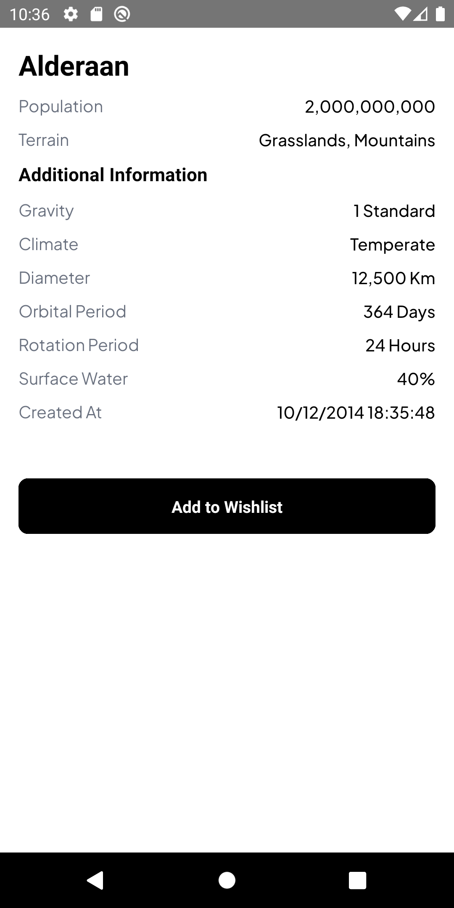

# Frontend Developer Test - React Native

> **Note**: Make sure you have completed the [React Native - Environment Setup](https://reactnative.dev/docs/environment-setup) instructions till "Creating a new application" step, before proceeding.

to run this app, clone this repository then install the library.

```
$ yarn install && yarn start
```

### TechStack Used

- React Native with TypeScript
- NativeWind (tailwindcss for react-native)
- Zustand for state management

## Screenshot



